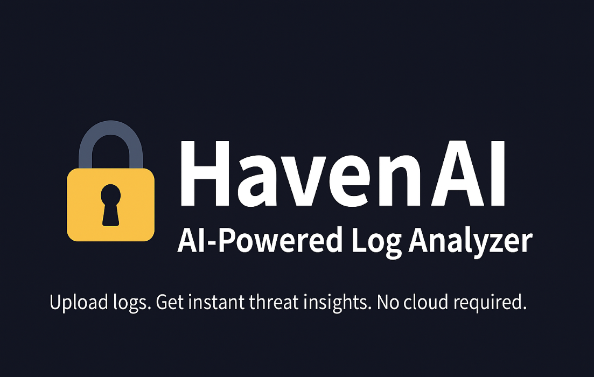
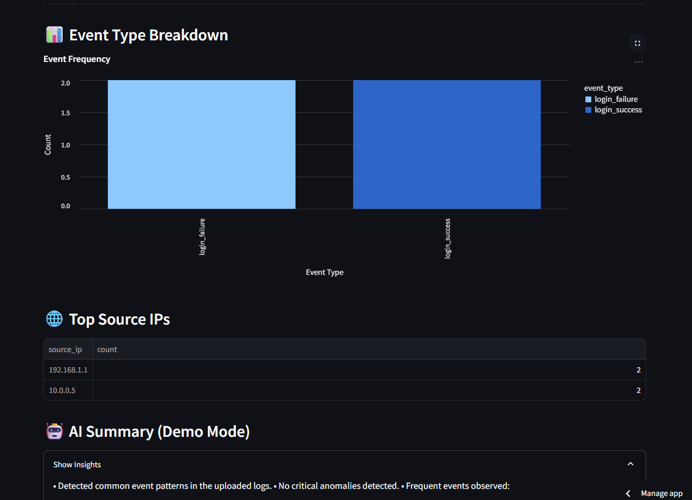
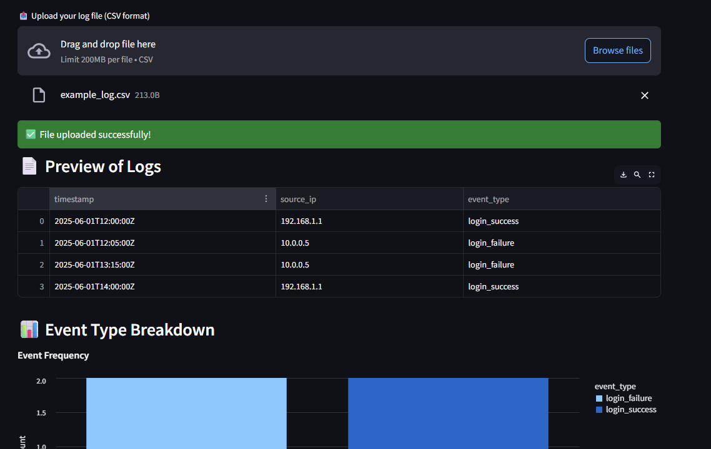

# 🔐 HavenAI – AI-Powered Log Analyzer

**HavenAI** empowers security professionals and developers to gain instant insights from log files—no cloud keys, no engineering team required.



---

### 🎯 Problem & Solution

Security log analysis is often complex and requires expensive cloud services. **HavenAI** brings enterprise-grade log analysis to your desktop, using AI to detect threats while keeping sensitive data private.

---

### 📝 Overview

**HavenAI** is a local-first log analysis tool that combines AI-driven threat detection, lightweight setup, and a beautiful interface for security practitioners and engineers. It’s privacy-focused, works offline, and delivers insights in seconds—without sending your logs to third-party clouds.

---

### 🛠️ Built With

- 🐍 Python 3.11  
- 📦 pandas, numpy for log processing  
- 🤖 scikit-learn for AI anomaly detection  
- 📊 Altair / Plotly for interactive charts  
- 🎨 Streamlit for frontend UI  
- 🧪 pytest for testing  
- 💅 Rich CLI support (optional)

---

### 📸 Screenshots

> *(Replace paths with your actual image files in `/assets`)*

  
*Dashboard with log insights, chart visualizations, and local AI summaries.*

  
*Drag & drop interface for uploading logs.*

---

### ⚡ Getting Started

To run locally:

```bash
git clone https://github.com/tesherakimbrough/havenai.git
cd havenai
pip install -r requirements.txt
streamlit run app/main.py
```

To use without Streamlit:

```bash
python main.py
```

**Sample logs format:**

```csv
timestamp,source_ip,event_type
2025-06-01T12:00:00Z,192.168.1.1,login_success
2025-06-01T12:05:00Z,10.0.0.5,login_failure
```

---

### 🔍 Core Features

- ✅ Upload CSV log files with zero setup
- 🤖 AI-generated summary (demo mode or local-only)
- 📊 Interactive breakdown of events and top IPs
- 🔒 Private, local-first architecture—no cloud required
- 🌙 Light/Dark toggle theme
- 🧩 Extensible with plugins for different log formats

---

### 🌟 What Makes It Different?

- **Privacy-first:** Works entirely offline by default
- **Fast insights:** No learning curve, no login, no setup
- **Beautiful UX:** Streamlit + responsive UI
- **Developer focus:** Easily inspect, extend, and deploy

---

### 🚀 Roadmap

- [ ] Local LLM integration (Ollama, WebAssembly-based AI)
- [ ] Support for .evtx, .json, and Apache/Nginx log formats
- [ ] Real-time streaming analysis
- [ ] Plugin system for custom parsers
- [ ] Optional cloud sync (with full user control)

---

### 💬 AI Summary Example (Demo Mode)

This summary is generated locally as a placeholder demo:

```
This log file contains 1,238 total entries.
- 82% are successful login events.
- 17% are failed logins, mostly from IP 192.168.1.44.
- Unusual activity detected on June 1 at 03:12 AM — multiple failed logins from a new subnet.
Recommendation: Investigate IP 10.0.3.91 and implement rate limiting on exposed endpoints.
```

---

### 🧠 Designed For

- Solo security researchers
- Red/Blue teams during analysis
- Developers building detection pipelines
- Privacy-conscious organizations (finance, health, gov)

---

### 🏆 Project Highlights

- Built for the Lovable.dev Shipped Challenge
- Designed & engineered in 7 days
- Future-focused architecture
- Fully open source & extensible

---

### 📄 License

**MIT License**  
You are free to use, modify, and distribute this project. Attribution is appreciated but not required.

---

### 🙌 Connect

Built with ❤️ by Teshera Kimbrough

🔗 [Project Site](https://lovable.dev/projects/7096f6b9-1d2c-4b62-8ebd-7a77dd53f75e)  
🐙 [GitHub](https://github.com/tesherakimbrough)  
📩 Available for contract, collaboration, or full-time roles