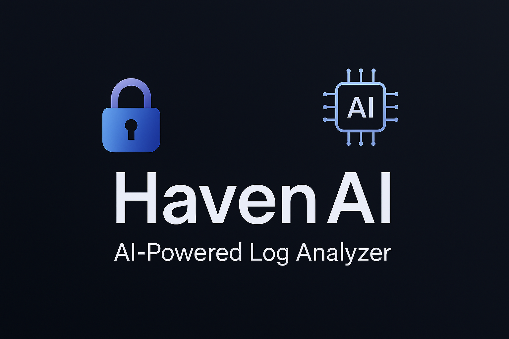

# 🔐 HavenAI — AI-Powered Log Analysis Copilot

> Upload logs. Get instant threat insights. No cloud keys or setup required.  
> Built for security analysts, engineers, and incident responders.

---


---

## 🌟 What Is HavenAI?

HavenAI is a lightweight, privacy-first AI security copilot built to help anyone analyze structured log data in seconds — no APIs, no account, no cloud storage.  

Use it in **demo mode** or extend it for production — it’s yours to run and improve.

---

## 🧩 Features

- ✅ **CSV Log Upload**  
- 📊 Real-time charts and summaries (event type, IP frequency)  
- 🧠 **Mock AI Summary** (demo mode, LLM-ready for future use)  
- ⚠️ **Anomaly Detection** (scikit-learn Isolation Forest)  
- 🧪 **Threat Scoring** based on patterns + anomalies  
- 🌐 **Multilingual UI**: English, 日本語, Español, 中文  
- 📥 **Export** CSV + Full AI Report  
- 🌓 **Light/Dark Theme Toggle**  
- 🔐 Modular support for future login/auth

---

## 🚀 Try It Out

### 🔧 Local Setup

1. Clone the repo  
```bash
git clone https://github.com/tesherakimbrough/havenai.git
cd havenai
```
2. Install dependencies
```bash
pip install -r requirements.txt
```

3. Run the app
```bash
streamlit run app/main.py
```
4. Open in your browser:
```bash
    http://localhost:8501
```

Screenshot


```

🧠 How AI Works (Demo Mode)
HavenAI uses a placeholder summary engine for now — designed to later plug into any LLM like GPT or Claude. Future-ready, not vendor-locked.

"Based on uploaded logs, several login_failure events were observed across 3 IPs. No critical anomalies detected."

```

📁 Project Structure

havenai/
│
├── app/
│   ├── main.py
│   ├── ai_summary.py
│   ├── threat_scoring.py
│   ├── export_report.py
│   ├── i18n.py
│   └── parser.py
│
├── assets/
│   ├── banner.png
│   └── screenshot.png
│
├── sample_logs/
│   └── example_log.csv
│
├── .streamlit/
│   └── config.toml
│
├── README.md
├── requirements.txt
├── LICENSE
└── Roadmap.md
```

📄 License
MIT — free for personal and commercial use. Attribution appreciated.

```

🧭 Roadmap
Check out Roadmap.md for what's next:

☁️ Optional cloud export (S3)

🔐 Auth for Pro mode

🌍 Translated AI summaries

```

💬 Contact & Showcase
LinkedIn

Figma Portfolio

Lovable Project Page

```


Built with ❤️ by Teshera — combining cybersecurity, human-centered design, and AI.